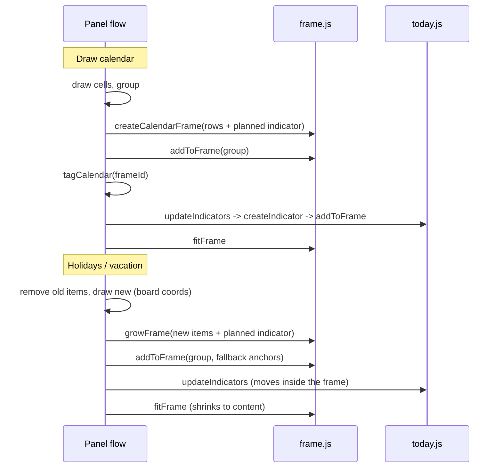

# Calendar in a Frame — Implementation Plan

> **For agentic workers:** This plan is cut for an agent fleet. Every task owns its files exclusively; the interfaces under "Contract" are binding verbatim. No task builds, lints or tests mid-flight — `node --test` runs once in wave 2.

**Goal:** A freshly drawn calendar sits in a white Miro frame titled with its range and year. Holidays/school-holiday bands, vacation bars and the TODAY indicator (circle, anchor, connector) live in the same frame. The frame is always sized to its content: it grows before anything is drawn or moved past its edge, and shrinks to the content once something was removed.

**Architecture:** Internally everything keeps computing in board coordinates, as today. Conversion happens only at the SDK boundary: when reading a position (`measure`, `dayCellsOf`, `moveIndicator`, holiday fallback anchors) and when writing a child's position (`moveIndicator`). Basis: a frame child reports `x`/`y` relative to the frame's top-left corner (`relativeTo: 'parent_top_left'`). The frame is found via `firstDay.parentId`; whether it is *ours* is decided by `entry.frameId`.

**Tech stack:** Vanilla ES modules, Vite 3, dayjs 1.11, Miro Web SDK v2, `node:test` + `node:assert/strict`.

## Decisions (user, 2026-10-08)

- The TODAY indicator belongs in the frame.
- Old calendars without a frame we created never get one — not on the next holiday or vacation import either.
- The frame is always appropriately sized — grows and shrinks.
- White background (`#ffffff`), title `describeRange(range)` → `"2026"` or `"2026 (Jul-Dec)"`.

## Global constraints

- English everywhere: panel strings, code comments, docs.
- Every board call goes through `run()` (or the new `runLevel3()`) from `src/board.js`. No module but `src/board.js` reads `window.miro`.
- Pure modules (`calendar.js`, `spans.js`, `vacation.js`, `holidays.js`, `colors.js`, `indicatorGeometry.js`, new `frameGeometry.js`) never import `board.js` — it reads `window` at load and would crash under Node.
- A rate-limit error is not "gone": where `getById` fails, `isRateLimitError(error)` keeps stored state and skips the pass.
- **Board coordinates internally, relative coordinates only at the SDK boundary.**
- **Conversion applies to any parent frame; management only to ours.** An old calendar the user dragged into their own frame also reports relative coordinates — `measure` must resolve that. Growing, shrinking and `frame.add` run only when `calendar.frameId !== null`.
- **The frame is a convenience.** Like grouping: every frame step is caught by the caller and reported with `console.warn('Timeline Builder: …')`. A failed frame step must never cost a calendar, an import or a holiday draw.
- **Grow first, then draw/add/move, fit last.** `frame.add` requires the item to already lie inside the frame, and moving a child past the edge is undocumented. So grow before, and end every flow with exactly one `fitFrame` that cuts to the actual content.
- **`placedY`/`placedAnchorY` stay in board coordinates.**
- **No migration.** An entry without `frameId` means "no frame of ours" and behaves bit-identically to today (origin `{ x: 0, y: 0 }` unless the board put it in a frame itself).

## Contract

### `src/frameGeometry.js` (new, pure)

```js
export const FRAME_MARGIN_ROWS = 1;   // margin around content, in rowHeights
export const MIN_FRAME_SIZE = 100;    // SDK minimum
export const BOARD_ORIGIN = Object.freeze({ x: 0, y: 0 });

/** Top-left corner of a frame ({x, y, width, height}, centre-based) in board coordinates. */
export function originOf(frame)                      // -> {x, y}

/** Child position -> board, and back. */
export function toBoard({ x, y }, origin)            // -> {x, y}
export function toParent({ x, y }, origin)           // -> {x, y}

/** Centre-based SDK rect -> edges; union; containment. */
export function edgesOf({ x, y, width, height })     // -> {left, top, right, bottom}
export function unionEdges(edgesList)                // -> edges | null for an empty list
export function containsEdges(outer, inner)          // -> boolean (equal edge counts as inside)
export function padEdges(edges, margin)              // -> edges grown by margin on every side

/** Frame rect around the union of edgesList plus margin, at least MIN_FRAME_SIZE per axis, centred on the content. */
export function frameRectFor(edgesList, margin)      // -> {x, y, width, height}

export function frameTitle(range)                    // -> describeRange(range)
```

### `src/frame.js` (new, board I/O)

```js
/** Origin of an item's parent frame; BOARD_ORIGIN when it has no parent.
 *  null when the parent is not a frame (SDK then reports -Infinity).
 *  `cache` is a Map frameId -> Frame so one pass fetches each frame once.
 *  Rate-limit errors propagate. */
export async function parentOrigin(item, cache = new Map())

/** Creates our frame: white, title frameTitle(range), enclosing edgesList plus
 *  FRAME_MARGIN_ROWS * rowHeight. No metadata: Miro rejects frame.setMetadata. Returns the Frame. */
export async function createCalendarFrame({ edgesList, range, rowHeight })

/** Grows only, never shrinks. No-op when everything already lies inside.
 *  New content gets FRAME_MARGIN_ROWS * rowHeight margin. */
export async function growFrame(frameId, edgesList, rowHeight)

/** Fits exactly to getChildren() ∪ extraEdges plus margin (grows and shrinks).
 *  Uses runLevel3. Connectors are skipped (no box). Writes only on a change > 0.5. */
export async function fitFrame(frameId, rowHeight, extraEdges = [])

/** frame.add(group) first; if that fails or there is no group, each item alone.
 *  `items` are additional items to add individually regardless (e.g. ungrouped anchors).
 *  Connectors are never added individually. Items already children of this frame are skipped. */
export async function addToFrame(frameId, { group = null, items = [] })
```

All functions in `frame.js` throw; the caller catches (see constraints).

### `src/board.js` / `src/rateLimit.js`

```js
// rateLimit.js
export const CREDITS_LEVEL_3 = 500;
// board.js
export const runLevel3 = (task) => limiter.run(CREDITS_LEVEL_3, task);
```

### Resolved calendar (`findCalendars` / `measure`)

Two new fields, everything else unchanged and still in board coordinates:

```js
{
  ...,
  origin,   // {x, y}: origin of the anchors' parent frame, BOARD_ORIGIN without parent
  frameId,  // string | null: set only if entry.frameId && firstDay.parentId === entry.frameId
}
```

### AppData entry

`tagCalendar({ ..., frameId = null })` writes `frameId: string | null`. Missing field = `null`.

### `src/indicatorGeometry.js` addition (pure)

```js
/** Edges covering the indicator from the circle's top to the anchor's bottom. */
export function indicatorEdges({ x, circleY, anchorY, diameter, anchorSize = 8 }) // -> edges
```

`today.js` exports `DIAMETER_FACTOR` so callers can compute the circle's planned edges:
`indicatorEdges({ x, circleY: indicatorY({...}), anchorY: anchorY({...}), diameter: rowHeight * DIAMETER_FACTOR })`.
`x` for planning purposes may be any column inside the calendar — the indicator is horizontally always within the calendar's columns, so only the vertical extent matters.

## Flows after the change



The tick in `index.js` only calls `growFrame` when the indicator would move past the frame, and `fitFrame` when the indicator was removed. Otherwise a tick costs one extra `getById` per framed calendar.

## Waves

| Wave | Tasks | Waits for |
|---|---|---|
| 1 | T0–T7 in parallel | — |
| 2 | T8 integration: `node --test`, build, review | wave 1 |
| 3 | T9 board acceptance (user) + README | wave 2 |

## T0 — Board-check note

**File:** `docs/superpowers/notes/2026-10-08-frame-unverified.md`, structured like `2026-08-11-bringtofront-und-konnektor-unbestaetigt.md` (question, assumption in code, how to spot the fallback, checklist, results table) — but in English.

Includes a console snippet for the panel iframe's DevTools (`miro.board` is available there) that answers:

| # | Question | Why |
|---|---|---|
| Q1 | Growing a frame up/left (`x`, `y`, `width`, `height` in one `sync()`) — do children keep their board position? | Core of `growFrame`/`fitFrame`. Code assumes yes. |
| Q2 | Same when shrinking. | `fitFrame` |
| Q3 | After `frame.add(group)`, does an item keep its `groupId`, and does `group.getItems()` report relative coordinates? | `dayCellsOf` |
| Q4 | Can a grouped frame child be moved via relative `x`/`y` + `sync()`? | `moveIndicator` |
| Q5 | What happens when a child is `sync()`ed past the frame edge: error, detach, clip? | justifies "grow first" |
| Q6 | Does `frame.add(group)` accept a group containing a connector (indicator)? | `addToFrame` fallback |
| Q7 | Does an item created via `createShape` inside a frame's area automatically become its child? | first read after creation |
| Q8 | Actual credit cost of `getChildren`, `frame.add`, `createFrame`. | `runLevel3`, tick cost |
| Q9 | Does `bringToFront` on circle + connector still work inside a frame? | `raiseIndicator` |

Plus the T9 acceptance checklist below.

## T1 — `src/frameGeometry.js` + `test/frameGeometry.test.js`

- Exactly the contract signatures. Imports only `describeRange` from `calendar.js`.
- Tests only for consumer-visible errors:
  - `toParent(toBoard(p, o), o)` round-trips.
  - `originOf` of a frame centred at `(0, 0)` sized 200×100 is `(-100, -50)`.
  - `frameRectFor` with margin: content plus margin on every side, centre at the union's centre.
  - `frameRectFor` enforces 100 per axis and stays centred on the content.
  - `containsEdges` at the boundary: equal edge → inside; 0.01 beyond → outside.
  - `unionEdges([])` is `null`.

## T2 — `src/frame.js`, `src/board.js`, `src/rateLimit.js`

- `CREDITS_LEVEL_3` next to `CREDITS_PER_ITEM`, with a comment naming which calls are Level 3. `runLevel3` in `board.js`.
- `parentOrigin`: no `item.parentId` → `BOARD_ORIGIN`. Else `getById(parentId)` (cached); `type !== 'frame'` → `null`.
- `createCalendarFrame`: `board.createFrame({ title, x, y, width, height, style: { fillColor: '#ffffff' } })`. No `setMetadata` — Miro rejects it on frames.
- `growFrame`: fetch the frame; if `containsEdges(edgesOf(frame), unionEdges(padded new edges))` → nothing. Otherwise `frameRectFor([edgesOf(frame), ...padded new edges], 0)`, write, `sync()`.
- `fitFrame`: `runLevel3(() => frame.getChildren())`, convert each child position via `originOf(frame)` to board, skip connectors, `frameRectFor(..., margin)`; write only on a change > 0.5. No children and no extras → leave the frame alone.
- `addToFrame`: as in the contract.

## T3 — read path: `src/anchors.js`, `src/dayCells.js`

- `measure`: after the three `getById`, resolve the origin **once**: `parentOrigin(firstDay)`. `null` → `{ reason: 'implausible', detail: 'calendar sits in an unsupported parent' }`. If `lastDay.parentId` or `topLeft.parentId` differs from `firstDay.parentId` → also `implausible` with its own `detail`. Rate limit from `parentOrigin` → `'rate-limited'`. Convert all three anchor positions with `toBoard` before `gridFrom`, `top`, `bottom`.
- `frameId` = `entry.frameId && firstDay.parentId === entry.frameId ? entry.frameId : null`.
- `origin` and `frameId` go on the resolved calendar.
- `tagCalendar` accepts `frameId = null` and writes it.
- `dayCellsOf`: compare `toBoard(item, calendar.origin).y` against `dayRowY`, sort by converted `x`.
- Update the doc comments of `findCalendars`/`measure` for the origin.
- A calendar without parent must yield bit-identical `grid`/`top`/`bottom` (origin 0).

## T4 — TODAY indicator: `src/today.js`, `src/indicatorGeometry.js`

- Add `indicatorEdges` (pure) with a test in `test/today.test.js`; export `DIAMETER_FACTOR` from `today.js`.
- `syncIndicator`: if `calendar.frameId` is set and the target (circle at `x`/`y`, anchor at `anchorTarget`) is not inside the current frame → `growFrame` before any move (caught).
- `createIndicator` receives the calendar (it already does): after grouping, if `calendar.frameId`: `growFrame` on the indicator edges, then `addToFrame(frameId, { group, items: group ? [] : [circle, anchor] })`. Caught. Frame steps come **after** `recordIndicator`, so they can never trigger the rollback.
- `moveIndicator`: each item with its own `parentOrigin` (it may have been dragged out of the frame), one cache per pass. Read: `toBoard(item, origin)` against targets. Write: `toParent({ x, y }, origin)`. A `null` origin (unsupported parent) → skip this pass for that item, warn.
- `removeIndicator`: afterwards, if a `frameId` is known, `fitFrame` (caught). Adjust both callers to pass it.
- `raiseIndicator`: unchanged.

## T5 — drawing the calendar: `src/app.js`

- New order in `drawCalendar`: draw → **group** → create frame → `addToFrame(frameId, { group })` → `tagCalendar({ …, frameId })` → `updateIndicators(…, { raise: true })` → `fitFrame`.
- Frame edges: the union of the drawn rows, computed from the row geometry (not per shape), plus the planned indicator edges when `drawTodayIndicator` is set and today is in range — so the first `createIndicator` does not immediately have to grow it.
- Grouping fails or a single shape → `addToFrame(frameId, { items: shapes })`.
- `createCalendarFrame` fails → `frameId = null`, warn, continue as today.
- `logDrawStats` gets a "Framing" line.
- Note: `board.group` returns the Group; keep it for `addToFrame`.

## T6 — holidays: `src/holidayDraw.js`, `src/holidayView.js`

- Fallback anchors in `drawHolidays`: `toBoard(cell, calendar.origin)` instead of `cell.x`/`cell.y`.
- After creating and before grouping, if `calendar.frameId`: `growFrame` on the edges of all created non-connector items plus the planned indicator edges (with the new `layout.reservedRows`). Caught.
- After grouping: `addToFrame(frameId, { group, items: anchors })` — anchors go into the frame so they stay on their cell when it moves. Without a group: all non-connector items individually. Caught.
- `runHolidays`: after `updateIndicators`, one closing `fitFrame` (caught) — also covers shrinking when the new block is smaller than the previous. Needs the calendar's `frameId` and `rowHeight`.

## T7 — vacations: `src/import.js`

- In `runImport` after `drawRows`, if `calendar.frameId`: `growFrame` on the bars plus the new anchor position (`anchorY` with `contentRows: rows.length`, via `indicatorEdges`), then group, then `addToFrame`, then `updateIndicators`, then `fitFrame`. All frame steps caught.
- Partial failure in `drawRows` (throws after the AppData write): no frame step; the next successful run fits.
- A run that removes the previous import and draws fewer rows must end smaller: the closing `fitFrame` handles it.

## T8 — integration (after wave 1)

- `node --test` fully green, `npm run build` passes.
- All callers of `removeIndicator` and `tagCalendar` match the new contract.
- Every read of a board position in `src/` is either converted or provably never a frame child (freshly created, before `frame.add`).
- Reviewer pass over the full diff: grow → add/move → fit order; rate-limit paths; bit-identity for unframed calendars.

## T9 — board acceptance (user) and docs

Checklist (in the T0 note):

1. Draw a full year → white frame titled `2026`; circle and line inside.
2. Draw Jul–Dec → title `2026 (Jul-Dec)`.
3. Holidays for three states → frame grows up and left (state labels); the calendar does not move.
4. Holidays again for one state → frame shrinks.
5. Import a large vacation set, then a small one → frame grows down and shrinks again.
6. Move the frame, reload, redraw holidays → everything lands on the right days.
7. Open a calendar drawn before this change → no frame appears, nothing moves; holidays and vacations work as before.
8. Drag an old calendar into a frame of your own, draw holidays → right days, your frame untouched.
9. Console: no `Timeline Builder:` warnings beyond expected ones.

README: a paragraph "The calendar lives in a frame": what goes in, old calendars get none, the frame's size follows its content (a hand resize is overwritten by the next flow).

## Out of scope

- A frame for old calendars, even on demand.
- Preserving a hand-resized frame.
- Storing `placedY` relative to the calendar.
- Nested frames.
